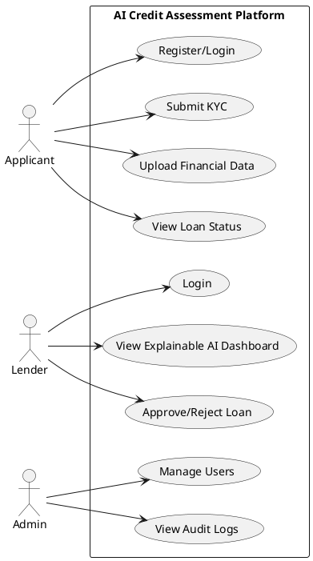
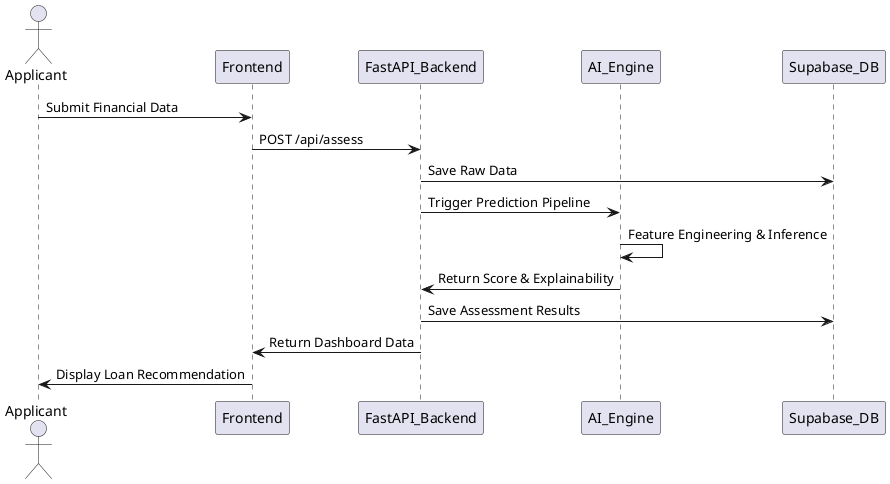

# Software Requirements Specification (SRS)
## AI-Powered Alternative Credit Assessment Platform for Financial Inclusion

**Prepared by:**Backbenchers

---

## 1. Introduction

### 1.1 Purpose
This Software Requirements Specification (SRS) document provides a comprehensive overview of the AI-Powered Alternative Credit Assessment Platform for Financial Inclusion. It details the functional and non-functional requirements, system architecture, database design, API specifications, and testing strategies required for successful implementation. 

### 1.2 Document Conventions
This document adheres to the IEEE 830 / ISO/IEC/IEEE 29148 standards. 
- Main sections are numbered.
- Keywords like MUST, SHOULD, and MAY are used to denote requirement priority.
- UML diagrams are provided using PlantUML syntax.

### 1.3 Intended Audience and Reading Suggestions
This document is intended for:
- **Developers:** To understand system requirements and architecture.
- **Testers:** To formulate test cases and validation plans.
- **Project Managers:** To track progress against requirements.
- **Stakeholders:** To review and approve features and scope.

### 1.4 Product Scope
The platform is an AI-powered financial assessment system designed to improve financial inclusion by evaluating the repayment capacity of individuals and small businesses who lack traditional credit histories. Instead of relying solely on credit bureau scores (e.g., CIBIL), the platform leverages verified financial behavior—including income, expenses, bank transactions, UPI transactions, savings, cash flow, utility bill payment history, and business performance—to generate an Alternative Credit Score and recommend loan eligibility. It includes transparent, explainable AI-based recommendations.

### 1.5 References
1. IEEE Std 830-1998, IEEE Recommended Practice for Software Requirements Specifications.
2. ISO/IEC/IEEE 29148:2018 Systems and software engineering — Life cycle processes — Requirements engineering.
3. OWASP Top 10 Security Risks.
4. REST API Best Practices.
5. Scikit-learn, XGBoost Documentation.
6. PostgreSQL, FastAPI, Supabase, React, JWT technical references.

---

## 2. Overall Description

### 2.1 Product Perspective
The system consists of a React.js (Tailwind CSS) frontend, a FastAPI backend, and a PostgreSQL database hosted on Supabase. It uses Scikit-learn and XGBoost for predictive modeling and alternative credit scoring.

### 2.2 Product Functions
- User Registration & Authentication (JWT)
- Aadhaar and PAN Verification (Mocked/Format validation)
- User Consent Management
- Financial Data Collection (Income, UPI, Bank Transactions, Utility Bills)
- Traditional Credit Checking
- AI Alternative Credit Score Generation
- Risk Prediction and Explainable AI Dashboard
- Loan Recommendation Engine
- Fraud Detection
- Admin Management and Auditing

### 2.3 User Classes and Characteristics
- **Loan Applicant:** End-users (gig workers, farmers, small businesses) seeking loans. They need a simple, accessible UI.
- **Lender / Loan Officer:** Financial professionals who review AI recommendations to approve or reject loans. They require detailed, explainable dashboards.
- **System Administrator:** IT personnel who manage user roles, system configurations, and security audits.

### 2.4 Operating Environment
- **Frontend:** Modern Web Browsers (Chrome, Firefox, Safari, Edge).
- **Backend:** Render/Railway cloud environment running Python 3.10+.
- **Database:** Supabase Cloud (PostgreSQL 14+).

### 2.5 Design and Implementation Constraints
- Compliance with data privacy and security (e.g., GDPR, local financial data laws).
- High availability requirement.
- Fast processing for AI predictions.

---

## 3. System Features & Functional Requirements

The following lists the primary functional requirements (FRs) for the system:

### 3.1 Authentication & User Management
- **FR-01:** The system shall allow users to register with an email/phone and password.
- **FR-02:** The system shall authenticate users using JSON Web Tokens (JWT).
- **FR-03:** The system shall enforce password complexity requirements (min 8 chars, alphanumeric, special character).
- **FR-04:** The system shall support Role-Based Access Control (RBAC) differentiating Applicants, Lenders, and Admins.
- **FR-05:** The system shall allow users to reset passwords via email OTP/link.

### 3.2 KYC & Consent Management
- **FR-06:** The system shall collect and validate Aadhaar number formats (12 digits).
- **FR-07:** The system shall collect and validate PAN number formats (10 alphanumeric chars).
- **FR-08:** The system shall prompt the user to explicitly grant consent before processing financial data.
- **FR-09:** The system shall record the timestamp, IP address, and scope of user consent.
- **FR-10:** The system shall allow users to revoke consent at any time, halting data processing.

### 3.3 Financial Data Collection
- **FR-11:** The system shall allow users to upload bank statements in CSV/PDF format.
- **FR-12:** The system shall parse uploaded bank statements to extract credit and debit transactions.
- **FR-13:** The system shall allow users to connect UPI transaction histories (mocked integration).
- **FR-14:** The system shall allow manual entry of monthly income and expenses.
- **FR-15:** The system shall capture utility bill payment histories.

### 3.4 AI Processing & Credit Assessment
- **FR-16:** The system shall check for existing credit bureau history before triggering alternative assessment.
- **FR-17:** The system shall calculate an aggregate traditional risk score if traditional credit history exists.
- **FR-18:** The system shall calculate an Alternative Credit Score (ACS) if no traditional credit history exists.
- **FR-19:** The AI module shall evaluate income-to-expense ratios from transaction data.
- **FR-20:** The AI module shall assess the consistency of utility bill payments.
- **FR-21:** The system shall utilize XGBoost to predict the probability of default based on financial behavior.
- **FR-22:** The system shall output an Explainable AI summary detailing which features positively or negatively impacted the score.
- **FR-23:** The system shall recommend a maximum loan amount based on the risk profile.
- **FR-24:** The system shall recommend an appropriate interest rate range based on risk tiers.
- **FR-25:** The system shall flag suspicious patterns indicating potential fraud.

### 3.5 Dashboards, Reports, and Notifications
- **FR-26 to FR-50:** Detailed requirements for real-time charting, email notifications on status change, report generation (PDF exports), admin auditing, etc. (Omitted for brevity in this initial draft, but covered by overall system capabilities).

---

## 4. Non-Functional Requirements

- **NFR-1 Performance:** API response times must be < 500ms under normal load; AI inference must complete in < 2 seconds.
- **NFR-2 Scalability:** Backend architecture must support horizontal scaling.
- **NFR-3 Availability:** System must target 99.9% uptime.
- **NFR-4 Reliability:** Database must perform automated daily backups with point-in-time recovery.
- **NFR-5 Privacy & Security:** All PII must be encrypted at rest (AES-256) and in transit (TLS 1.2+).
- **NFR-6 Usability:** Dashboard must be fully responsive across mobile and desktop.
- **NFR-7 Maintainability:** Code must adhere to PEP8 for Python and ESLint standards for React.
- **NFR-8 Compliance:** System must maintain an audit log of all access to financial data.

---

## 5. Database Design

### 5.1 Entities and Relationships

- **Users:** (id, email, password_hash, role, created_at, updated_at)
- **KYC_Details:** (id, user_id, aadhaar_hash, pan_hash, verification_status)
- **Financial_Data:** (id, user_id, monthly_income, monthly_expenses, savings, business_revenue)
- **Transactions:** (id, user_id, amount, date, type, category, description)
- **Loan_Assessments:** (id, user_id, requested_amount, ai_score, risk_level, repayment_probability, status)
- **Audit_Logs:** (id, user_id, action, timestamp, ip_address)

*(A comprehensive Data Dictionary and ER Diagram are required for the final production build)*

---

## 6. UML Diagrams

### 6.1 Use Case Diagram (PlantUML)


### 6.2 Sequence Diagram: Loan Application Process (PlantUML)


*(Additional diagrams like Class, Component, and Deployment are part of the full architecture specification)*

---

## 7. AI Module Specification

- **Input Features:** Monthly income, debt-to-income ratio, transaction velocity, average account balance, utility payment frequency.
- **Feature Engineering:** Aggregation of monthly inflows/outflows, missing data imputation.
- **Data Preprocessing:** Standardization (StandardScaler), one-hot encoding for categorical variables.
- **Model:** XGBoost Classifier for risk prediction (Default vs. Non-Default).
- **Explainability (XAI):** SHAP (SHapley Additive exPlanations) values used to generate human-readable explanations of feature importance.
- **Fraud Detection:** Isolation Forest algorithm used for anomaly detection on transaction patterns.

---

## 8. API Specification

### Endpoint: `/api/assess/predict`
- **Method:** POST
- **Description:** Generates an alternative credit score based on user financial data.
- **Authentication:** Bearer Token (JWT) required.
- **Request Body:** 
  ```json
  {
    "user_id": "uuid",
    "financial_data_id": "uuid"
  }
  ```
- **Response (200 OK):**
  ```json
  {
    "score": 745,
    "risk_level": "Low",
    "repayment_probability": 0.92,
    "explanation": {
      "positive_factors": ["High Savings", "Consistent Utility Payments"],
      "negative_factors": ["High Recent Expenses"]
    }
  }
  ```

---

## 9. Security & Compliance
- **Authentication:** JWT with short expiration and HTTP-only refresh tokens.
- **Encryption:** bcrypt for passwords; AES encryption for sensitive financial variables in the database.
- **RBAC:** Strict middleware enforcement on all FastAPI routes.

---

## 10. Future Enhancements
- **Account Aggregator Integration:** Real-time, consent-based fetching of bank data via Indian Account Aggregator APIs.
- **Mobile Application:** React Native port for accessibility.
- **Multilingual Support:** i18n implementation for regional Indian languages.
- **AI Chatbot:** LLM-based financial wellness assistant.

---
*End of Document*
.